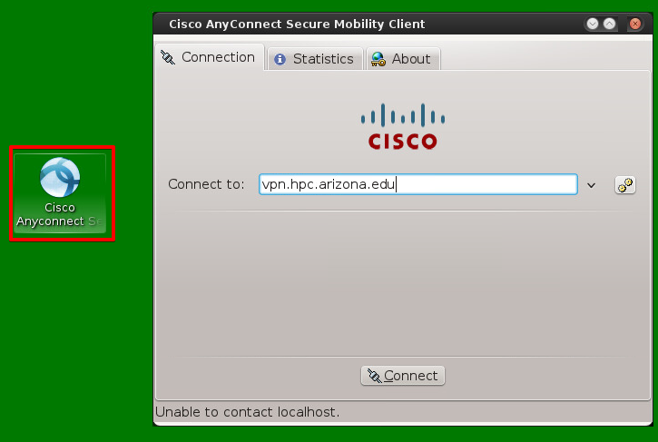
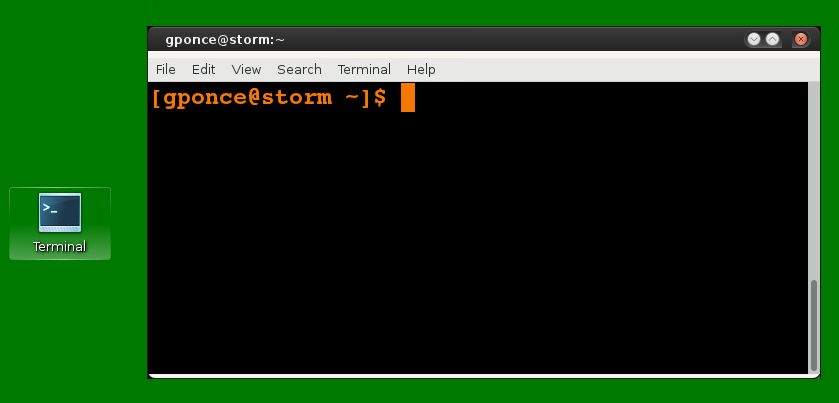
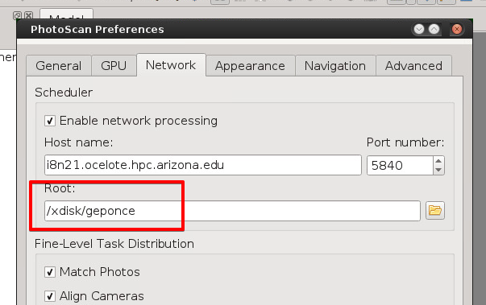
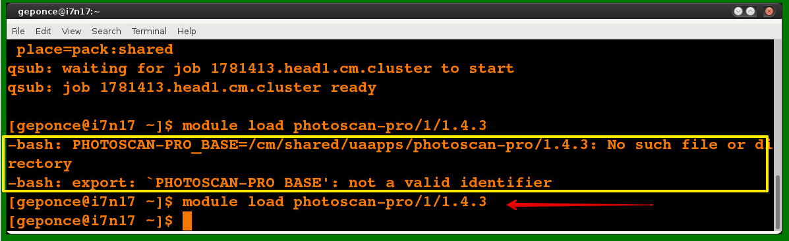
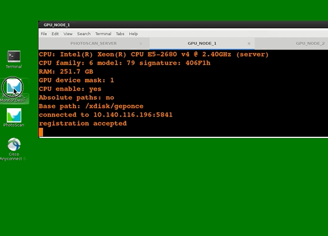

The aim of this notebook is to document the steps for processing drone
imagery using PhotoScan Pro and the High Performance Computing services
from The University of Arizona (UA). Users of these resources are part
of a collaboration project between USDA-ARS-SWRC and UA.

This guide is fully based on the official support Wiki from Cyverse-GIS
that can be found
[here](https://github.com/cyverse-gis/suas-metadata/wiki/On-Demand-Processing-with-University-of-Arizona-HPC).

The steps described below have been tested using an account in the Storm
server environment. This server is located at the SWRC-ARS SWRC
facilities and users connect to it by using VNC (Virtual Network
Connection) software to access a graphical user interface (GUI).

**Note:** Non-Storm users could follow these steps from any terminal or
command-line where Secure Shell (SSH) is installed. The main reasons
behind running these tests from Storm server are:

1.  PhotoScan license available in Storm
2.  X-Window configuration is already set for all users in Storm.
3.  Other software (e.g. SSH tools, Cisco VPN) already available for
    every user in Storm (ssh,ssh-keygen, ssh-copy-id, sshfs,etc.).

Screencasts are included in this guide to support users that are not
familiarized with some of the concepts mentioned.

### 1. Requirements

-   UA-NetID (<your_username@email.arizona.edu>)
-   Passcodes (Numbers sent by message by the UA for
    2-factor-authentication)
-   Access to a terminal/command line with Secure Shell software (SSH)
    installed
-   A folder ready with all the drone imagery and PhotoScan project.
    This need to be transfered to UA-HPC.

### 2. Connecting to UA-VPN from Storm server

In this step you need to open the software called Cisco AnyConnect VPN
and connect to `vpn.hpc.arizona.edu`. In the Storm desktop you will find
an icon named "Cisco Anyconnect Secure Mobile" as you can see in the
image below.

  Type `vpn.hpc.arizona.edu` in the input text box in case is not
already there. Then, click connect and type username, password, and
passcode.

**Note**: The 2-factor authentication requires the use of passcodes,
thus Cisco interface will indicate the initial number of the passcode
you need to use. This number will show up in the bottom part
(information bar) of the window (i.e. the section where it says
`Unable to contact localhost.` in the image above). These passcodes are
commonly sent by text message.

### 3. Opening a Terminal

Once the connection to the UA-VPN is ready is time to test the
connection to the UA-HPC servers. Open the Terminal software or any
other software that provides access to the console/command line, see the
icon in the image below for one option in Storm. Terminal is just a name
commonly used in Unix-like systems to identify the command line tool.

  Ready to set up the connection to the UA-HPC from the terminal!

### 4. Set up UA-credentials

This is a **one-time-only** step, you will NOT do this everytime you
want to process some imagery.

Why do you need this?

To save time and avoid password and passcode requests everytime you need
to access a UA-HPC server. Instead, you will type your UA-NetID password
and passcode once and that is it. For the following ssh connections you
should not get password/passcode requests. Your credentials are divided
into public and private, the public part is sent to the UA-HPC and the
private stays in your user's folder.

  

A brief description of what you see in the steps showed in the
screencast above:

##### 4.1 Generating credentials

This is for creating public and private keys. Let default values and
just hit enter at all of the questions. From the user command line type:

    ssh-keygen -t rsa

##### 4.2 Connect to the HPC server

Next, connect to the HPC server using `ssh`.

    ssh geponce@hpc.arizona.edu

After some messages are displayed you will get the question:
`Are you sure you want to continue connecting (yes/no)?`, just type
`yes`. Then you get the `password:` request, just type your UA-NetID
password. Next, if your password was correct, you need to type the
`passcode`.

If everything went smooth, you should be connected at the `gatekeeper`
server.

Just type `exit` to logout from this server and continue with the next
step.  

##### 4.3 Copy public key to the UA-HPC

After you exited from `gatekeeper` HPC server you will be at your STORM
command line, that is where you need to type the following:

    ssh-copy-id -i ~/.ssh/ida_rsa geponce@hpc.arizona.edu  

After this, your public key was copied into your UA-HPC user and now you
should be **ready to make further ssh connections without having to type
your password and passcode**.

### 5. Transfer data to UA-HPC

The folder with imagery and PhotoScan project should be ready to be
copied into UA-HPC.

-   The location `/xdisk/username` needs to be created in Storm just
    once. Check the availability of the folder by typing
    `ls /xdisk/username`. If you can't list it, please request its
    creation at USDA-ARS-SWRC.

-   All the projects can live within that folder since this is just a
    shared file system in the UA-HPC.

-   User should copy the project folder into this path.

Type the following line in your Storm terminal to mount the file system.

    sshfs -o sshfs_debug geponce@filexfer.hpc.arizona.edu:/xdisk/geponce /xdisk/geponce

Now you can copy your project folder to your `/xdisk/username` and
automatically everything that you copy into it will be sent to the
UA-HPC.

    cp /home/username/DATA/project1 /xdisk/geponce/

Folder `project1` is copied (sent to UA-HPC) to `/xdisk/geponce/`
network file system.

This path (`/xdisk/geponce/`) will be used in the
`PhotoScan Preferences` in the `Network` tab (see red box in the image
below).

  

PhotoScan will point to this `/xdisk/username` folder and the physical
location of that folder will be at the UA-HPC.  

**Note:**

One question that emerged during this step is: Where should I
start/store my project at? E.g. If the project is stored in
`/username/projects/proj1/`, PhotoScan will save that path in the
metadata of the project. Thus, if the project is moved into
`/xdisk/username` for doing the heavy lifting processing, PhotoScan will
look for the former path. Therefore, metadata should be checked before
starting the HPC processing to make sure that the references to file
paths are correct.

### 6. Request a node for PhotoScan Server (orchestrator)

Next step is to request/initiate the PhotoScan Server. This is a
node/computer that will work as the orchestrator of the processing,
coordinating the access to PhotoScan at each CPU's/GPU's.

First, open a terminal and connect to HPC-Server (gatekeeper).

    ssh -X geponce@hpc.arizona.edu

If you did the credentials setup steps, you should not get the
password/passcode request.

Once you are connected type this to request access to the `Ocelote`:

    ocelote -X 

At the Ocelote command line, type the following line to request the
server node.

    qsub -X -I -N photoscan-server-node-1 -m bea -W group_list=tswetnam -q standard -l select=1:ncpus=12:mem=32gb -l cput=72:0:0 -l walltime=72:0:0 -l place=pack:shared

You might need to wait a minute or two before getting the resource
access granted. Some of the parameters have been changed to increase the
resource reservation time. E.g. `walltime`, in case the processing goes
beyond a day or two. For more information you can see the official
[Cyverse-GIS guide on
PhotoScan](https://github.com/cyverse-gis/suas-metadata/wiki/On-Demand-Processing-with-University-of-Arizona-HPC).

**Screencast exemplifying the run of previous commands:**

### 7. Loading PhotoScan Pro software for the Server

Once you get access to the server node, you will be at the command line
of the server you just requested. Here you need to activate/load
PhotoScan Pro License.

Run this:

    module load photoscan-pro/1/1.4.3

**Note:** For some reason, the first time you try to load the license
you get an error message, try again and it should work, see below.

### 8. Start PhotoScan as a Server (orchestrator)

In this step, you need to identify the name of the server that was
assigned to you. You can find it at the left side of the cursor in the
command line, see below in the animated example, the server/node name is
highlighted.

Run this line to activate the PhotoScan Server (orchestrator).

    # Change the name of the server by the one you got
    photoscan.sh --server --dispatch i7n17.ocelote.hpc.arizona.edu --control i7n17.ocelote.hpc.arizona.edu --root /xdisk/geponce

The server domain will be different, depending on what server was
assigned to you. You get the name and then append
`ocelote.hpc.arizona.edu`. The final part of the command is the name of
your folder, `/xdisk/username`, previously configured.

In the screencast below you will see the type of output messages you
might get during these steps.

### 9. Request GPU node

Now, it's time to request nodes with GPU capability. For this, open a
new terminal (Do not close the one from the previous step with the
server).

Run this in the new terminal to connect to `gatekeeper` that will let
you request the nodes with GPU:

    ssh -X geponce@hpc.arizona.edu

Ok, now you are at the `gatekeeper` node again, get into the Ocelote
running this:

    ocelote -X 

Now, you are at the command line ready to ask for a node, instead of
asking for a server node, you will be asking for a GPU node and this is
the line you need to run:

    qsub -I -X -N jobtest -W group_list=tswetnam -q windfall -l select=1:ncpus=28:mem=196gb:ngpus=1 -l cput=1344:0:0 -l walltime=72:0:0 

You might need to wait a few seconds or minutes before getting node
access granted. The node reservation time (`cput`) is for 2 days (28
cpus \* 48 hrs).

In the next section you can see the previous commands running in a
screencast.

### 10. Load PhotoScan @ Node

At the command line of the assigned node/gpu load the PhotoScan license
for it. Remember to run this line twice if you get a message error the
first time.

    module load photoscan-pro/1/1.4.3

### 11. Start PhotoScan as a Node (GPU)

The final step in setting up the GPU node is to start it as a PhotoScan
Pro node by running the following line:

    photoscan.sh --node --dispatch i7n17.ocelote.hpc.arizona.edu --capability any --cpu_enable 1 --gpu_mask 1 --root /xdisk/geponce

**Do not forget to change the server name.**

See the previous steps running in the screencast below:

  

**Note:**  You will need a new request for every GPU node you want

See the example below where a new terminal is opened and another GPU
node request is done for the same server in this example, `i7n17`.

In the example below, the tabs from the terminal are renamed to identify
where the server and GPUs were requested. By switching between tabs at
the Terminal software you will be able to see what is going on with the
Server/Orchestrator and the GPU nodes.

  

From here, you can go through the same process as many times as nodes
you want. Right now (Jan/2019) the maximum number of GPU nodes you are
able to request is 10.

### 12. Start PhotoScan Network Monitor

At the Storm user's Desktop find the program Photoscan\_Monitor. This
will start the software that will allow you to monitor the activity of
the GPU's network.

Using this monitoring tool you can connect to the PhotoScan Server
(orchestrator) you will see the server and the GPU nodes
working/progress.

 

As you can see, the connection is made to the PhotoScan server and at
the bottom part, the list of GPU nodes shows up. Once you start the
processing in the PhotoScan Pro GUI you will see activity in this
monitoring tool.

### 13. Testing from the PhotoScan Pro GUI

Here is a screencast showing the use of PhotoScan GUI in Storm (using
SWRC-ARS-SWRC PhotoScan License) on how to open the project and run the
process "Build Dense Point Cloud" using the configured UA-HPC cluster.

  

### 14. Comments/Remarks

-   To add previous steps to the "Build Dense Point Cloud" process (e.g.
    alignment with RTK) will improve this document.

-   Also, it would be useful to continue documenting the workflow to
    show how to generate other end-products beyond the point cloud.

-   To investigate how to make projects with relative file paths instead
    of absolute, as is set in the metadata. As it was mentioned above,
    when files are copied to UA-HPC in the file system
    `/xdisk/username`, PhotoScan will try to find imagery and other
    files in whatever path is the project in and that is not the way
    PhotoScan works in a distributed computing environment; imagery
    needs to exist within the `/xdisk/username`.

-   These steps might involve lots of command-typing, but at this point,
    this workflow is the best choice to process lots of images in
    PhotoScan, especially if the goal is to run this process for several
    flights.

-   This process took ~ 1 day of processing time for building "Dense
    Point Cloud" with a project of 2000 photos at High quality and mild
    depth filtering versus 7 to 10 days when using a single computer.

-   The processes demonstrated here could reach a higher level of
    automation by taking advantage of the Python API provided by Agisoft
    and some of the resources offered by the UA-HPC team.
