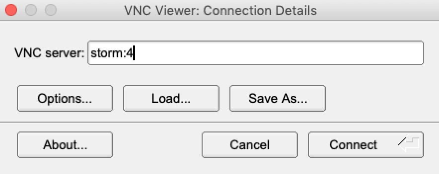

## Using ARS-SWRC Storm server to access Metashape in the University of Arizona HPC (High Performance Computing) server

### 1. Get an account in Storm server @ USDA-ARS-SWRC 

#### Why using Storm? 

- Storm is a high-performance node with a significant amount of RAM (1.4 TB) and 
storage.
- Access to graphical interface (windows-like)
- Storm has the operating system RedHat 7.6 Linux installed, this is relevant 
because a lot of the HPC systems use the same or similar OS, therefore, it helps
with the interaction (terminal and X-window systems)
- Regarding X-window system, this might be the most important reason on using 
Storm. A lot of the interaction with the HPC requires having the X-system 
installed in the host computer. 
- Finally, Storm could be an option to keep projects centralized, which might be 
important when you need to deal with several of them. 

### 2. Login to your Storm account

The first step in login to Storm is to access ARS-VPN (swrcvpn).  Ask ARS 
IT-Personnel for the user and password to access through Cisco ARS-VPN.

Once connected to the VPN, there are two ways to login to **Storm** server.

1.Using telnet-like connection 
`ssh user_name@storm` or if name resolution doesn't work, try this:
`ssh user_name@10.1.2.234` 

2.Using VNC (Virtual Network Connector) viewer

Right now the only VNC viewer is being used in Storm is [TigerVNC](https://bintray.com/tigervnc/stable/tigervnc/1.9.0)

Install the corresponding version of TigerVNC for your local computer Operating
System.  
Run the TigerVNC viewer and use the port number provided for your 
storm user. In the image below, the port is 4. If `storm` does not work, use the
Storm's internal ip address: `10.1.2.234`.  E.g. `10.1.2.234:4`

### 3. Set up UA-credentials to access HPC

This is a one-time-only step, you will NOT do this everytime you want to process some imagery.

#### Why do you need this?

To save time and avoid password and passcode requests everytime you need to access a UA-HPC server. Instead, you will type your UA-NetID password and passcode once and that is it. For the following ssh connections you should not get password/passcode requests. Your credentials are divided into public and private, the public part is sent to the UA-HPC and the private stays in your user's folder.

- Open terminal in Storm
- Run `ssh-keygen -t rsa` (see animation)

- Run `ssh user_name@hpc.arizona.edu`

After you exited from gatekeeper HPC server you will be at your STORM command line, that is where you need to type the following:

**NOTE** Don't forget to change the permissions to 600 to files `id_rsa, known_hosts` 
and to 644 for `id_rsa.pub` before trying the following.

`ssh-copy-id -i ~/.ssh/ida_rsa user_name@hpc.arizona.edu`

After credentials are copied to the HPC server run the following:

`ssh-add` 

Then, test it, the following should not ask for the Duo two-factor login anymore.

`ssh user_name@hpc.arizona.edu` 

### 4. Copy data into xdisk partition

First, create a `xdisk` partition at the Ocelote HPC cluster. This is only done
once, and it's where data should reside, so all the nodes can see the imagery.

For creating `xdisk` file system do the following:

- Connect to HPC: `ssh -X user_name@hpc.arizona.edu`

- Once connected, get into Ocelote: `ocelote -X`

- Then do the storage request for `xdisk`. E.g. To get 700GB for 45 days run
this instruction in the command line from Ocelote: `xdisk -c create -m 700 -d 45` 

Exit from Ocelote and HPC. From your account in Storm run this (**Note**: Make sure
there is a folder in Storm called `/xdisk/user_name`, if not, ask to Storm 
server administrator to create it for you):

`sshfs -o sshfs_debug user_name@filexfer.hpc.arizona.edu:/xdisk/user_name /xdisk/user_name`

Running the previous command will ask for your UA Authentication protocol 
(2 factor auth). Again, this is only one-time step, since once is created in 
your account at Ocelote, it will remain active until your expiration date of the
xdisk file system.

Regarding expiration date, you will receive an email when the number of days you
selected is close, so you will have the option to extend the number of days
of your file system.  For example, to extend your file system time period for 
20 days, just connect to HPC and enter to Ocelote and run this: 
`xdisk -c expire -d 20`. 

If you don't extend the date your files will be removed.

##### Copying files to `xdisk` in Ocelote

In Storm terminal you can start copying files by doing this:

Change to the directory where you have the data that will be moved to the HPC
and then run the copy instruction:

`cp -R * /xdisk/user_name`  

This could take some time since it will copy (transfer) all the files/folders 
from Storm to the HPC xdisk system.

#### Miscellaneous tasks (Just for the case where you start a project out of /xdisk... path)

Metashape saves absolute path inside of metadata xml files when your `DCIM` folder
is located in a different folder than your project.  Therefore, it is necessary 
to update those paths in that case.

For example:
`RG83_flight_9-13-2018` project was started in `/home/user/Projects/RG83_flight_9-13-2018`
and the `DCMIM` folder was in another location `/mnt/DATA/...`.  

This caused some issues when project was copied into the networked filesystem
`/xdisk/geponce` due to the project had an absolute path for all the images.

Thus, it was necessary to update the PATH to use the folder of the network 
filesystem 
e.g. `/xdisk/geponce/RG83_flight_9-13-2018/RG83_flight_9-13-2018_gepc.files/DCIM/`

The fastest way (AFAIK) to change the path of all the photos at once is by accessing the `doc.xml` file inside the project folder, `/xdisk/geponce/RG83_flight_9-13-2018/RG83_flight_9-13-2018_gepc.files/2/0`.  
This will vary by project and this file is zipped by Metashape as `frame.zip`, 
just unzip it and open `doc.xml`, usually is the only file uncompressed.  

**NOTE:** Metashape has an option to change the Path of the images, do it for one and then 
save the project, so when you uncompress the zip file `frame.zip` you will see 
the first image with the correct path.  The next step is to do it for all the 
images.

The line that needs to change will looks like this: 
` <photo path="../../../../../../../../mnt/DATA/users/TEMP/PhotoScan/RG83_flight_9-13-2018/DCIM/102MEDIA/DJI_0001.JPG"> `

- Open doc.xml using `vi`
- Search and replace in vi `ESC + :%s /old_path/new_path/g`  
The slash in the paths `/` must be escaped by prefixing `\` at each one

In this example the `..` correspond to the different levels that Photoscan uses when images are within subfolders

`:%s /..\/..\/..\/..\/..\/..\/..\/..\/mnt\/DATA\/users\/TEMP\/PhotoScan\/RG83_flight_9-13-2018\/DCIM\//..\/..\/..\/DCIM\//g `

Once the paths are fixed it is time to move forward.  

### 5. Start Metashape as a server in STORM

This will start Metashape as a server. 

`/mnt/DATA/DOWNLOADS/SOFTWARE/METASHAPE/metashape-pro/metashape.sh --server --control 10.1.2.234 --dispatch 10.1.2.234 --root /xdisk/user_name`

### 6. Get GPU node(s)

#### Connect to HPC Ocelote from local computer

`ssh -X user_name@hpc.arizona.edu`

`ocelote -X`

### Request gpu

Recall the `walltime` is pretty much the parameter you want to keep an eye because
if your process could take more than N-days, you should be setting this parameters
accordingly.  In this case is set to 3 days or `72` hrs.  Try to keep the other 
parameters the same.

`qsub -X -I -N metashape-singularity -m bea -W group_list=tswetnam -q standard -l select=1:ncpus=28:mem=196gb:ngpus=1 -l cput=1344:0:0 -l walltime=72:0:0`

**Note**: No more requests are allowed after 10 nodes granted, need to ask Tyson
or HPC folks since 20 Metashape licenses were installed.

### Load singularity 

After node is granted, run this:

`module load singularity` 

### Execute Metashape inside Singularity container in HPC and dispatch it to STORM

This will enable Metashape to run in GPU's using Metashape server in Storm as the 
node-coordinator.  `user_name` in the following line need to be changed for the 
current user.

`singularity exec --nv /xdisk/user_name/metashape-ubuntu16.sif /opt/metashape-pro/metashape.sh  --node --dispatch 198.22.133.207 --capability any --cpu_enable 1 --gpu_mask 1 --root /xdisk/user_name`

Go to Storm server and start Metashape Monitor (GUI) to follow node's activity.

Start Metashape and proceed to do the processing.

